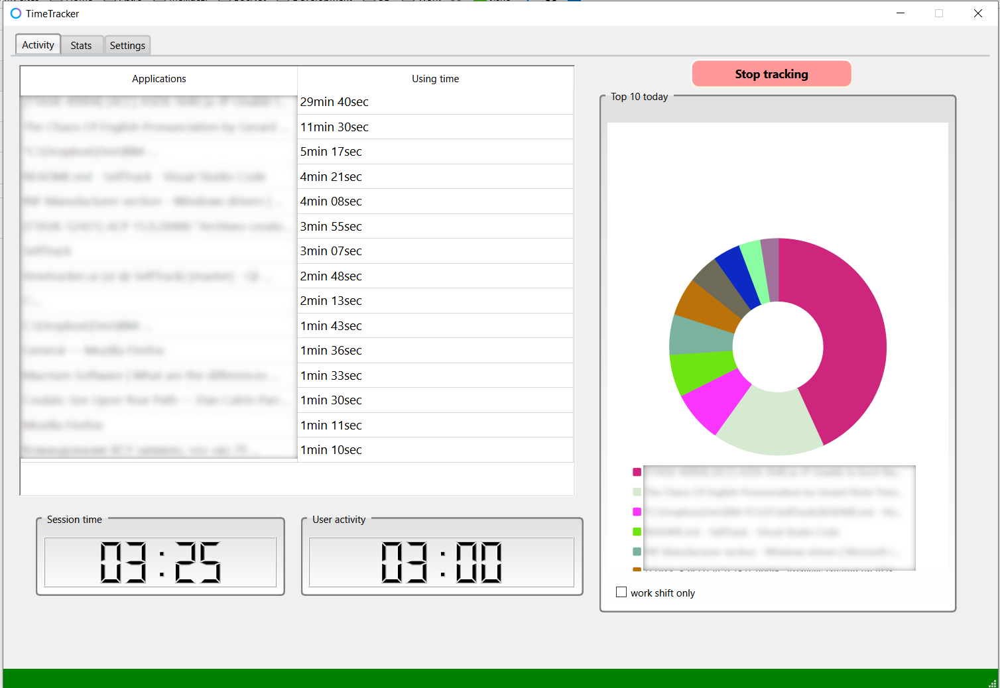

# Time tracking utility for Windows

> **Note:** The tool is still work in progress.

## Description

I made it for myself to control my work on PC (excessive use of chats etc)

##  What works

* Tracks for how long PC was unlocked and how much time an user spent working
* Top 10 application used
* App usage history
* Detects system lock and unlock
* Simple SQLITE DB to store data - easy to scale

## What doesn't work yet

* Notification
* Weekly/monthly filters
* Blacklist apps/site from tracking

## How to build

    I use QT 6.5.0 and MinGW GCC 12.1

## Prebuilt version

is available from releases section

